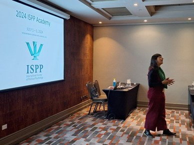
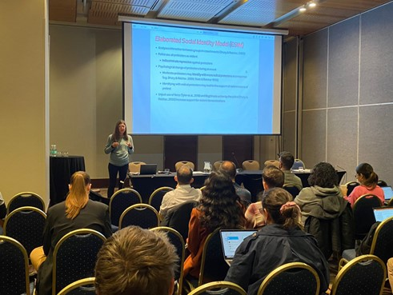
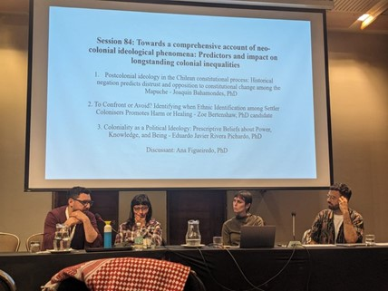

Del 4 al 6 de julio tuvo lugar en Santiago el Annual Scientific Meeting realizado por el International Society of Political Psychology (ISPP). Este importante congreso internacional tuvo como centro temático las raíces psicológicas de los conflictos relacionados con el creciente autoritarismo y su impacto en las sociedades democráticas. Con el título de ‘Dismantling Democracy: Insecurity, Emotions and Authoritarian Populism’, a lo largo de tres días, se presentaron 13 paneles y más de 80 ponencias en las que participaron investigadoras e investigadores provenientes de distintas disciplinas, como la psicología social, la ciencia política y la sociología, entre otras.

Investigadoras e investigadores del equipo OLES participaron activamente en este congreso, presentando avances de sus más recientes investigaciones.

La investigadora Ana Figueiredo (UOH), además de participar en la organización del congreso, presentó en dos paneles y participó como discussant en otras mesas. En términos de sus presentaciones, participó primero en el Panel 76: Insecurity and Distance from Democracy in Majorities and Minorities during Global Crisis and Uncertainty. En este panel, la investigadora presentó su trabajo titulado: "Distrust in democratic processes of change among the Mapuche people in Chile: an analysis of the 2020-2022 constitutional process". Su presentación se centró en la desconfianza y la distancia del Estado que han desarrollado los grupos minoritarios, en particular el pueblo Mapuche, durante el proceso de cambio constitucional del Estado chileno.

Luego, participó en el Panel 97: Double Standards in Migration, Ethnicity and Intergroup Relations. En este panel, presentó su ponencia "Double standards in intergroup relations: a theoretical reflection on coloniality and racialized communities". Esta presentación teórica abordó el concepto de colonialidad y su impacto en las comunidades racializadas a nivel global, destacando los dobles estándares que privilegian a ciertos grupos sobre otros. La investigadora ilustró su argumento en el caso de la violencia estructural y sistémica contra el pueblo Mapuche en Chile para mostrar cómo las relaciones intergrupales se ven afectadas por matrices de dominación y opresión. Por último, la investigadora participó como discussant en dos paneles: “Political Resistance in Authoritarian Contexts. Part 2: Repression and Resistance” y “Towards a Comprehensive Account of Neo-Colonial Ideological Phenomena: Predictors and Impact on Longstanding Colonial Inequalities”, aportando en la discusión sobre resistencia política y los fenómenos ideológicos neocoloniales.

La directora del observatorio y académica de la UDP, Mónica Gerber, presentó la ponencia titulada “Police use of force promotes protester violence: the mediating role of social identity and perceived procedural justice in the context of police-protester relationships." En su trabajo mostró cómo la experiencia de violencia policial incide en la percepción de justicia procedimental y en la identificación de las personas con los manifestantes, y cómo esto tiene un efecto en la justificación de la violencia de los manifestantes hacia la policía. Utilizando en conjunto el enfoque de la Justicia Procedimental y el Elaborated Social Identity Model, su trabajo avanza en la comprensión de los mecanismos detrás de la acción colectiva.

Joaquín Bahamondes, profesor de la escuela de psicología de la Universidad Católica del Norte, presentó en el Panel 84: “Towards a comprehensive account of neocolonial ideological phenomena: Predictors and impact on longstanding colonial inequalities”. En este panel, el investigador del equipo OLES presentó su ponencia “Postcolonial ideology in the Chilean constitutional process: Historical negation predicts distrust and opposition to constitutional change among the Mapuche”.  En este trabajo, el autor analizó en qué medida las personas Mapuche internalizaron los discursos críticos con las políticas de reconocimiento indígena llevadas a cabo en el proceso de cambio constitucional. Para eso analizó específicamente si las creencias que minimizan las historias de injusticia que enfrentan los Mapuche y los imperativos por reparación, junto a las afirmaciones de la exclusión de los símbolos Mapuche de la identidad nacional, podían predecir oposición al cambio constitucional del 2019 y desconfianza en la asamblea constitucional durante 2022.  Sus resultados destacaron el rol de la negación histórica en predecir oposición y desconfianza en el cambio constitucional, lo que se alineó con una concepción consensual de la ideología como una manifestación de falsa conciencia que mina el apoyo a los intereses del grupo.  

Finalmente, Luciano Sáez, estudiante y académico de la Universidad Diego Portales, presentó la ponencia “Compromiso, resistencia y evitación: ¿Cómo se vincula la ciudadanía con las policías en Chile?”. En su trabajo analizó cómo diversos grupos sociales (derecha, izquierda, indígenas, inmigrantes y manifestantes) expresan diferentes niveles de legitimidad y despliegan diferentes posturas hacia la policía en Chile. Dialogando con los estudios sobre legitimidad policial, justicia procedimental y posturas motivacionales, el investigador profundizó en las experiencias de vinculación con la policía, explorando tres posturas motivacionales para comprender la distancia que las personas en Chile movilizan frente a Carabineros: el compromiso, la resistencia y la evitación.

De esta forma, las investigadoras e investigadores de OLES hicieron contribuciones significativas al desarrollo de la psicología política a través de sus presentaciones. Este congreso no solo resaltó las agendas de investigación que se desarrollan al interior de nuestro observatorio, sino que también abrió nuevos caminos para la colaboración interdisciplinaria, fortaleciendo la psicología política como campo esencial para abordar los desafíos democráticos contemporáneos.
