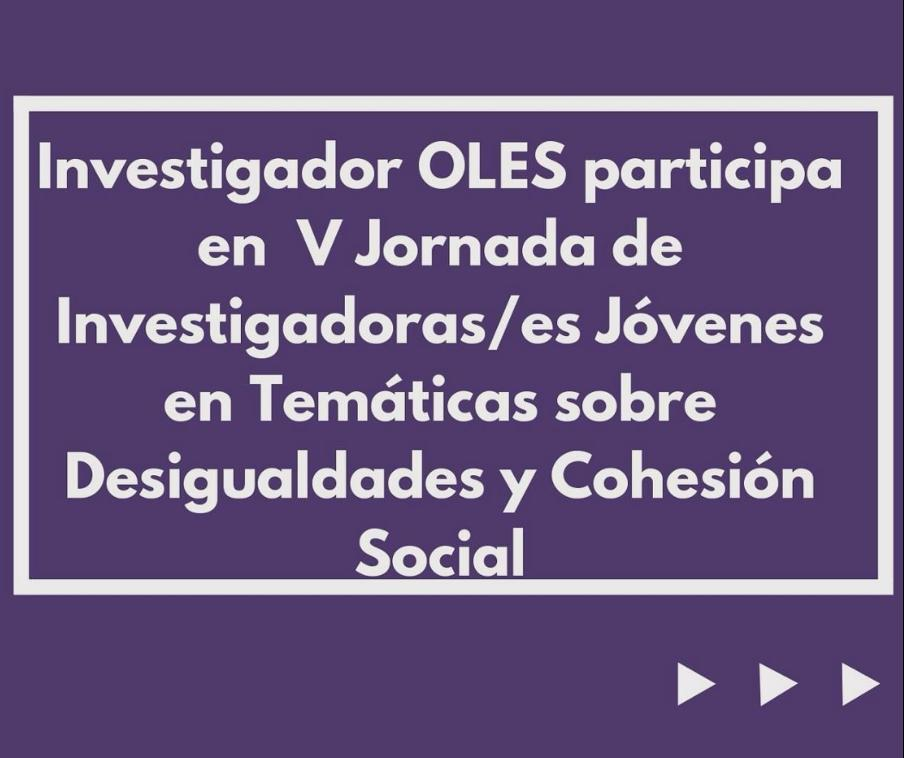
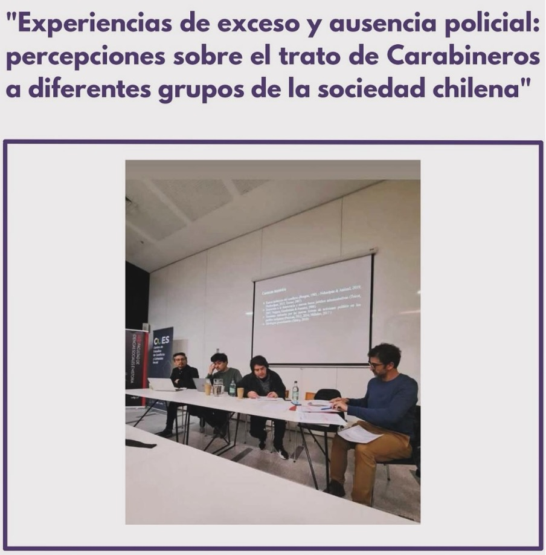

El viernes pasado, nuestro Investigador de la UDP, Luciano Saez, compartió su investigación en la “V Jornada de Investigadoras/es Jóvenes en Temáticas sobre Desigualdades y Cohesión Social” del Observatorio de Desigualdades de la Universidad Diego Portales (OBDE) y el Centro de Estudios de Conflicto y Cohesión Social (COES) 🌎.

La jornada buscaba crear un espacio de intercambio y reflexión sobre investigaciones cuantitativas y cualitativas de jóvenes estudiantes de pregrado y posgrado, enfocadas en las diversas formas de desigualdad y su relación con la cohesión social.

En este contexto, Luciano presentó su investigación: “Experiencias de exceso y ausencia policial: percepciones sobre el trato de Carabineros a diferentes grupos de la sociedad chilena”.

📚 Resumen de la investigación: En los últimos años, el rol de las policías ha cobrado gran relevancia en el debate público. Las masivas protestas entre 2019 y 2021, la crisis sociosanitaria por COVID-19 y la actual crisis de inseguridad han demostrado un cambio en los niveles de apoyo público hacia Carabineros, la principal policía en Chile. Los próximos años son claves para su futuro.

Luciano reflexiona sobre cómo las personas experimentan la presencia policial en sus vidas y cómo perciben el trato que Carabineros otorga a distintos grupos de la sociedad chilena. A través de 14 grupos focales realizados entre 2022 y 2024 en diferentes zonas del país, se analizaron las experiencias y percepciones de diversos grupos (izquierda, derecha, jóvenes, mapuche, inmigrantes y manifestantes).

Luciano destaca la importancia de indagar en las experiencias de trato para replantear la comprensión de la relación entre policías y ciudadanía, especialmente en el contexto de posibles reformas a la institución de Carabineros y la discusión pública sobre un mayor empoderamiento policial.

¡Esperamos que esta investigación inspire nuevas reflexiones y debates! 💬✨

