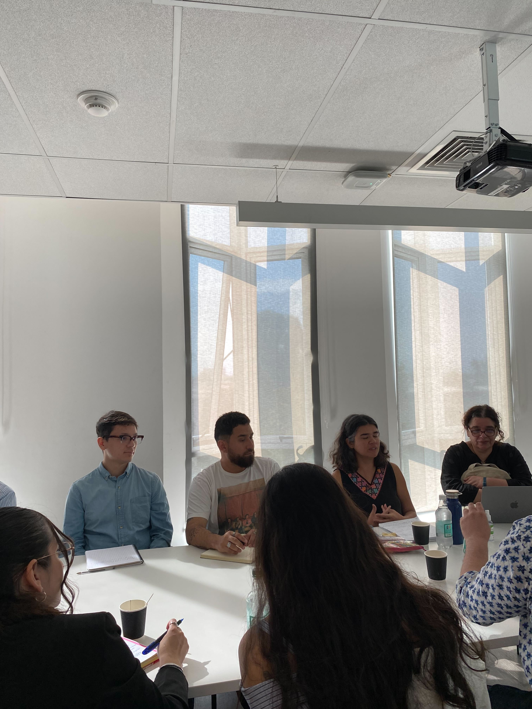
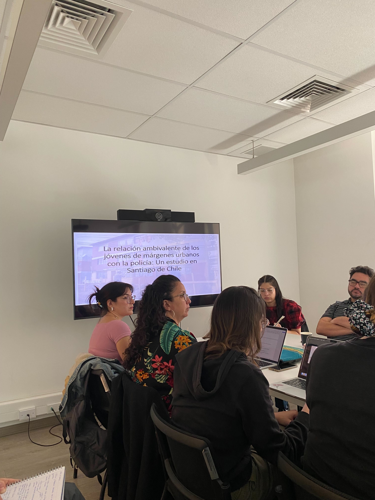

El pasado viernes 28 de marzo, en la Facultad de Filosofía y Humanidades de la Universidad de Chile, se llevó a cabo el Taller de trabajo “Policía y Márgenes Urbanos: Perspectivas interseccionales de investigación”, una instancia que reunió a estudiantes de magíster y doctorado, investigadores e investigadoras de distintas disciplinas, con el fin de reflexionar sobre las relaciones entre la policía y los sujetos que habitan los márgenes urbanos.

La actividad fue organizada en conjunto por el Proyecto Fondecyt Regular N°1240879 “Género, policía y márgenes urbanos” dirigido por Alejandra Luneke, el Instituto Milenio de Investigación en Violencia y Democracia (Viodemos) y el Núcleo Milenio Complejidad Criminal, y contó con la participación de destacadas ponentes. Dentro de ellas, resaltó la intervención de la Dra. Loreto Quiroz, investigadora de OLES y del Instituto de Ciencias Sociales de la Universidad de O´Higgins, quien presentó su trabajo titulado: “Entre la Protección y la Sospecha: percepciones ambivalentes de jóvenes de márgenes urbanos sobre la policía en Santiago de Chile.”

En su exposición, la investigadora OLES profundizó en las tensiones que viven los y las jóvenes en su relación cotidiana con la policía, marcada por el anhelo de sentirse protegidos y la simultánea experiencia de ser constantemente vigilados. A partir de experiencias recogidas en grupos focales con jóvenes de barrios populares de Santiago, la investigadora describió cómo estos sectores valoran la presencia policial cuando se trata de brindar seguridad, pero a la vez rechazan los excesos en el control que terminan por convertirlos en sospechosos. Asimismo, enfatizó la relevancia de abordar estos procesos desde perspectivas de largo plazo y de conocer más a fondo los contextos en que crece la desconfianza, sin dejar de lado la influencia de condiciones estructurales de género, clase y territorio.

Este análisis, que evoca las complejas dinámicas de seguridad y desconfianza, fue muy bien recibido por el público presente, especialmente por quienes se encuentran trabajando en temas de juventud, violencia y marginalidad urbana. En la misma línea, otras expositoras, como Haydée Caruso (Universidad de Brasília) y Alejandra Mohor (Centro de Estudios en Seguridad Ciudadana, CESC), abordaron metodologías y enfoques teórico-comparativos sobre la legitimidad policial en distintos contextos latinoamericanos.

Al cierre de la jornada, el equipo organizador destacó la riqueza de los intercambios y la pertinencia de seguir profundizando —con miradas interseccionales— las relaciones que se dan entre instituciones policiales y comunidades vulnerables. Se hizo hincapié, además, en la necesidad de nutrir las políticas públicas con evidencia empírica y con estudios que consideren la dinámica del poder que se dan entre las fuerzas que buscan establecer el control y las poblaciones controladas.

Con una alta participación e interés de las y los asistentes, el Taller dejó en evidencia la importancia de generar espacios de discusión académica y colaborativa, para comprender mejor las experiencias y relaciones entre barrios pobres y las policías, así como las posibles rutas de investigación.

