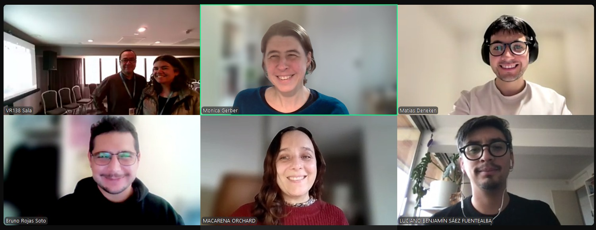
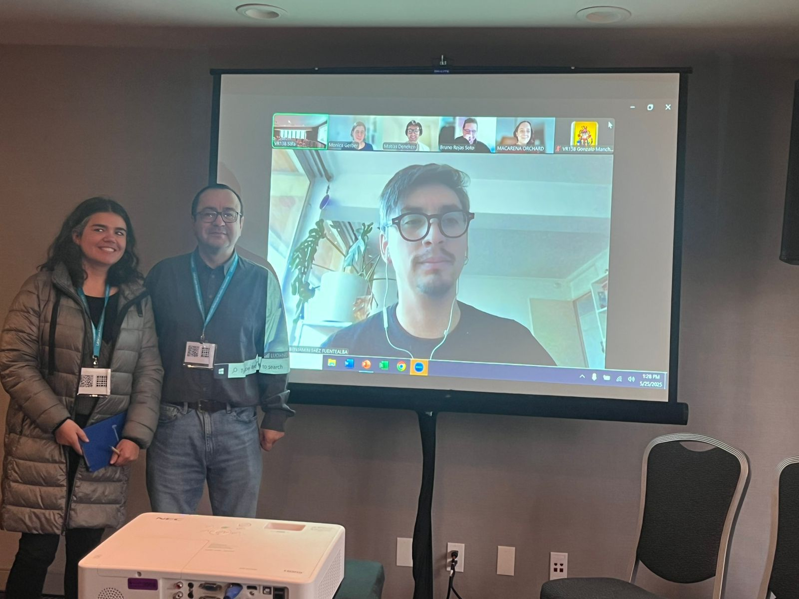

Con una participación híbrida, el equipo de OLES formó parte de la Conferencia Anual de la Latin American Studies Association (LASA), realizada entre el 24 y el 26 de mayo de 2025 en la ciudad de San Francisco, Estados Unidos. El evento congregó a académicos y académicas de distintas partes del mundo para discutir los principales desafíos políticos, sociales y culturales que atraviesan América Latina.

En el marco de LASA 2025, el equipo contribuyó al panel titulado “Policías y ciudadanía en Chile: representaciones, reformas y legitimidad”, organizado por Bruno Rojas (Universidad de Chile), con Loreto Quiroz (Universidad de O’Higgins) como moderadora.

El panel reunió investigaciones recientes que abordan desde múltiples enfoques las tensiones, transformaciones y desafíos que enfrentan las instituciones policiales en Chile, particularmente Carabineros, en su relación con la ciudadanía. Las presentaciones fueron las siguientes:

-   *Apoyo al uso de armas por parte de Carabineros de Chile: ¿Factores instrumentales, normativos o ideológicos?*, a cargo de Monica M. Gerber y Luciano L. Sáez Fuentealba (Universidad Diego Portales), analizó los determinantes del respaldo ciudadano al uso de la fuerza letal por parte de la policía.

-   *Reforma policial en Chile: ¿Controles, eficacia, control de uso de la fuerza?*, presentada por Claudio A. Fuentes Saavedra (Universidad Diego Portales), examinó los dilemas normativos y políticos de la actual agenda de reforma a Carabineros.

-   *Una* radiografía *a la* coberturamediática *de* laspolicías *en Chile:* Análisis *longitudinal a* partir *de* losmedios *de* prensa *on-line (2000–2024)*, a cargo de Matías Deneken (OLES), Matías Gómez (PUC) e Ismael Puga (UCEN), abordó cómo los medios han representado a Carabineros en las últimas dos décadas y los efectos de estos relatos sobre su legitimidad pública.

-   *Dinámicas del respeto entre la ciudadanía y carabineros: La tensión entre respeto categórico, posicional y performativo*, de Macarena Orchard (Universidad Diego Portales), propuso una mirada sociológica a las formas en que se negocia el respeto en los encuentros cotidianos entre ciudadanos y policías.

La participación del equipo de OLES en este espacio internacional refuerza su compromiso con la investigación crítica, interdisciplinaria y aplicada sobre las relaciones entre instituciones públicas, seguridad y ciudadanía.

