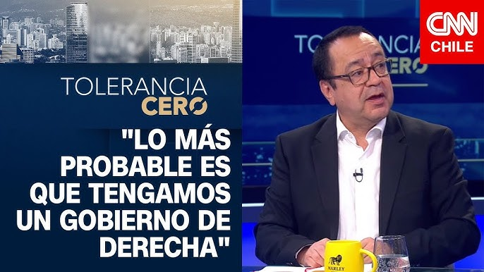

El día 7 de octubre de 2025, Claudio Fuentes—investigador OLES y director del ICSO-UDP—fue a Tolerancia Cero (CNN Chile) para analizar la carrera presidencial. 

Con datos de la Encuesta ICSO-UDP, describió un escenario con Jeannette Jara (27%) y José Antonio Kast (25%) a la cabeza, seguidos por Evelyn Matthei (12%), Johannes Kaiser (9%), Franco Parisi (9%) y Harold Mayne-Nicholls (5%); Eduardo Artés y Marco Enríquez-Ominami alcanzan 1%. Proyectó que “lo más probable” es un gobierno de derecha y subrayó que, aunque el apoyo de Kast se mantiene estable (≈27–30%), cambió su composición: parte de los segmentos D/E habría migrado hacia Kaiser y Parisi. Agregó que Jara sostiene respaldo femenino sin crecimiento marcado, evaluó la campaña de Matthei como errática y destacó un dato novedoso: la juventud se divide entre Kast y Jara, algo inédito en Chile.

Sobre los temores vitales, el investigador OLES explicó que son miedos cotidianos y materiales (delincuencia, perder el empleo, dificultades económicas) que se consolidaron tras el estallido social y el proceso constituyente. Estos temores empujan a una parte del electorado hacia opciones de derecha y, en particular, ultraderecha, donde mensajes de orden y seguridad encuentran terreno fértil. En ese marco, debates como “Chao préstamo” y la propuesta de ajuste fiscal por US$ 6.000 millones en 18 meses han reordenado preferencias en sectores populares y medios. Fuentes añadió que, a diferencia de 2021, hoy “se le perdió el miedo” a Kast, a quien parte del electorado percibe más establecimiento y moderado que Kaiser.

{width="700"} 
