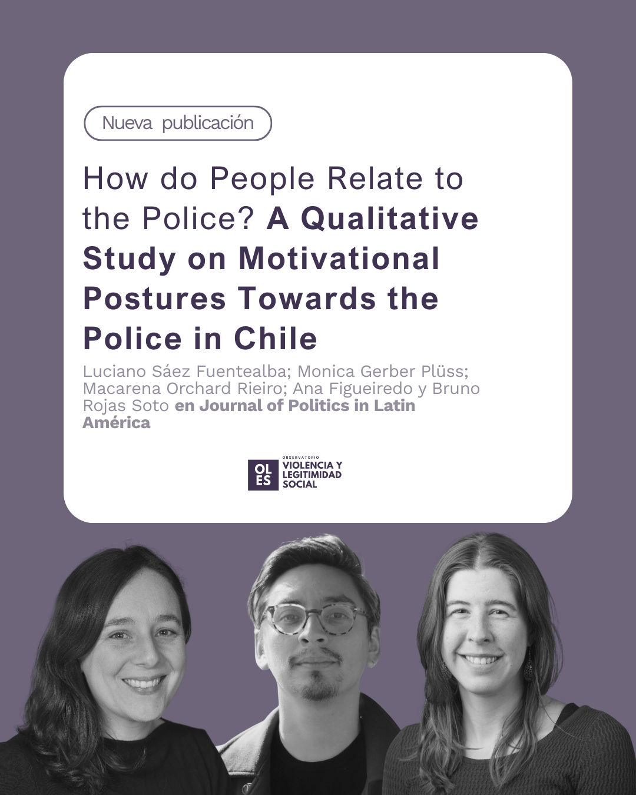

Las y los investigadores Luciano Sáez Fuentealba, Mónica Gerber Plüss, Macarena Orchard Rieiro, Ana Figueiredo y Bruno Rojas Soto publicaron recientemente el artículo How do People Relate to the Police? A Qualitative Study on Motivational Postures Towards the Police in Chile en Journal of Politics in Latin America, un aporte que se vincula directamente con las líneas de trabajo de OLES sobre legitimidad social, prácticas de violencia y relaciones entre instituciones y ciudadanía.

El estudio indaga cómo distintos grupos se posicionan frente a Carabineros, explorando los sentidos, motivaciones y experiencias que moldean la relación cotidiana con la policía en Chile. A través de once grupos focales realizados en tres ciudades y con participantes de diversas nacionalidades, identidades étnicas y orientaciones políticas, la investigación ofrece una mirada profunda a las posturas que subyacen al vínculo entre ciudadanía y fuerzas policiales.

Los resultados muestran la persistencia de actitudes de capitulación y resistencia, pero también la aparición de un compromiso condicionado que depende de contextos específicos y trayectorias individuales. El estudio identifica además una postura adicional de evitación, caracterizada por el distanciamiento activo y la interrupción de interacciones con la policía como estrategia para reducir riesgos o conflictos.

Estos hallazgos aportan a la comprensión de los mecanismos de legitimidad y a las tensiones que estructuran las relaciones entre instituciones de control y la ciudadanía. El artículo subraya la importancia de analizar estas dinámicas para fortalecer marcos interpretativos que permitan repensar prácticas policiales en clave democrática y orientar políticas públicas más sensibles a la complejidad del conflicto social.

{width="700"}
